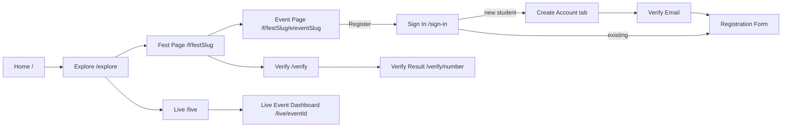
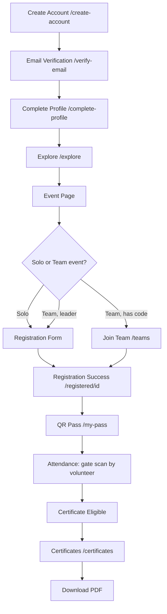
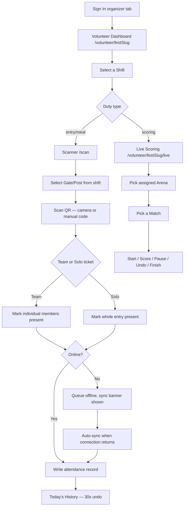
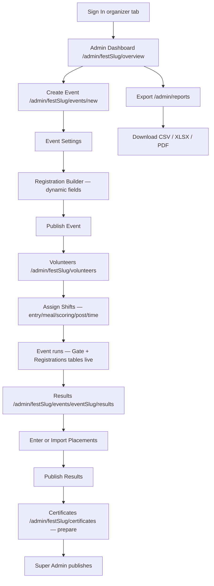
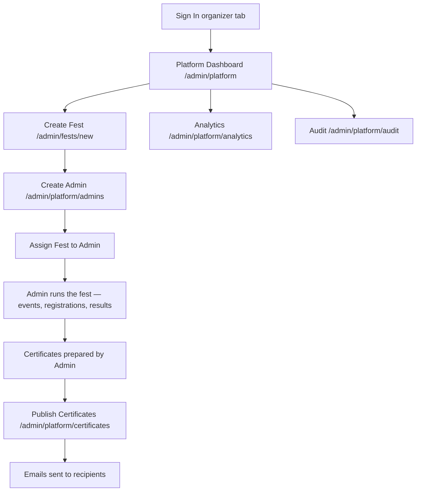
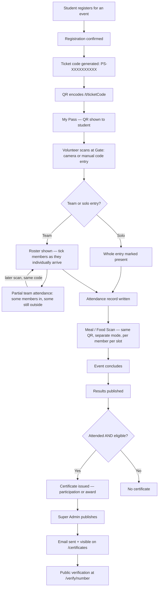
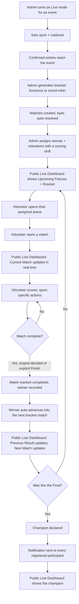

# Plansphere — UX Documentation (v1)

**Purpose:** This document extracts the complete, *already-implemented* UX flow of the Plansphere codebase (formerly FestFlow) so a UI/UX designer can recreate every screen in Figma without reading source code. Nothing here is proposed, redesigned, or invented — every route, field, state and flow below was verified directly against the repository (`src/app`, `src/components`, `src/core/models`) as it stands today, Parts 1–7 complete (Auth/RBAC, Student, Volunteer, Admin, Super Admin, QR/Certificates, Analytics, Live Event Engine).

**Product identity:** Plansphere is the product/legal name; the wordmark reads "Plansphere" everywhere (`src/lib/site.ts`). Ticket codes and certificate numbers use a `PS-` prefix (with `FF-` still accepted for records issued before the rename).

---

## Table of Contents

1. [Information Architecture](#1-information-architecture)
2. [Screen Inventory](#2-screen-inventory)
3. [User Flow Diagrams](#3-user-flow-diagrams)
4. [Navigation Map](#4-navigation-map)
5. [Screen States](#5-screen-states)
6. [Forms](#6-forms)
7. [QR Journey](#7-qr-journey)
8. [Live Event Journey](#8-live-event-journey)
9. [Component Inventory](#9-component-inventory)
10. [Notes for the Designer](#10-notes-for-the-designer)

---

## 1. Information Architecture

### 1.1 Public Visitor (no account)

```
Public
├─ Home (/)
├─ Explore (/explore)                — public fest catalogue (requires no login to browse)
├─ Fest Page (/f/[festSlug])
│  └─ Event Page (/f/[festSlug]/e/[eventSlug])
├─ Live
│  ├─ Live Directory (/live)
│  └─ Live Event Dashboard (/live/[eventId])
├─ Verify a Certificate
│  ├─ Verify Search (/verify)
│  └─ Verify Result (/verify/[number])
├─ Public Ticket Page (/t/[ticketCode])
├─ For Colleges (/for-colleges)
├─ Privacy Policy (/privacy)
├─ Terms & Conditions (/terms)
└─ Auth entry points
   ├─ Sign in (/sign-in)
   ├─ Create account (/create-account) — redirects into /sign-in?tab=create
   ├─ Forgot password (/forgot-password)
   ├─ Set password (/set-password) — from an emailed link
   ├─ Verify email (/verify-email)
   └─ Auth action handler (/auth/action) — Firebase email-link landing
```

### 1.2 Student (signed in, role = student)

```
Student
├─ Explore (/explore) — same catalogue, now with "Register" enabled
├─ My events (/my-events)
├─ My pass (/my-pass) — QR wallet, default landing after sign-in
├─ My registrations (/my-registrations)
├─ Registration success (/registered/[registrationId])
├─ Teams (/teams) — join-by-code + team membership status
├─ Certificates (/certificates)
├─ Notifications (/notifications)
├─ Profile (/profile)
└─ Account
   ├─ Complete profile (/complete-profile) — forced after first sign-up
   └─ Change password (/change-password)
```

### 1.3 Volunteer (role = volunteer, scoped to assigned fests)

```
Volunteer
├─ Entry redirect (/volunteer) → sends to the volunteer's one fest
├─ Fest-scoped shell (/volunteer/[festSlug])
│  ├─ My shifts (index) — roster of entry/meal/scoring shifts
│  ├─ Shift detail (/volunteer/[festSlug]/shifts/[shiftId])
│  ├─ Scanner (/volunteer/[festSlug]/scan) → hands off to shared /scan
│  ├─ Live scoring (/volunteer/[festSlug]/live) — only if assigned a scoring shift
│  └─ Team (/volunteer/[festSlug]/team) — the volunteer's own team memberships, if any
├─ Fest-agnostic entry points (redirect to the fest-scoped route above)
│  ├─ /volunteer/scan
│  └─ /volunteer/live
└─ Profile (/volunteer/profile)
```

### 1.4 Admin (role = admin, scoped to assigned fests)

```
Admin
├─ Entry redirect (/admin) → one fest → /admin/[festSlug]/overview, or fest picker if several
├─ Fest picker (/admin/fests) — only if scoped to more than one, or super admin
│  └─ New fest (/admin/fests/new) — super admin only
├─ Fest shell (/admin/[festSlug])
│  ├─ Overview (/admin/[festSlug]/overview)
│  ├─ Events (/admin/[festSlug]/events)
│  │  ├─ New event (/admin/[festSlug]/events/new)
│  │  └─ Event detail (/admin/[festSlug]/events/[eventSlug])
│  │     ├─ Settings (…/settings)
│  │     ├─ Registrations (…/registrations)
│  │     ├─ Analytics (…/analytics)
│  │     ├─ Results (…/results)
│  │     └─ Live (…/live) — tournament config, bracket, arena assignment
│  ├─ Registrations (/admin/[festSlug]/registrations) — fest-wide table
│  ├─ Gate (/admin/[festSlug]/gate) — live check-in dashboard + scanner launchers
│  ├─ Arenas (/admin/[festSlug]/arenas)
│  ├─ Analytics (/admin/[festSlug]/analytics)
│  ├─ Certificates (/admin/[festSlug]/certificates)
│  ├─ Volunteers (/admin/[festSlug]/volunteers)
│  ├─ Staff (/admin/[festSlug]/staff)
│  ├─ Console (/admin/[festSlug]/console) — super admin only, within a fest
│  └─ Settings (/admin/[festSlug]/settings)
├─ Cross-fest shortcuts
│  ├─ /admin/analytics → redirects to the admin's own fest analytics (or platform, for super admin)
│  └─ /admin/reports — Export Center (pick a fest or, for super admin, the whole platform)
├─ Profile (/admin/profile)
└─ Health (/admin/health) — system diagnostics
```

### 1.5 Super Admin (role = super_admin, unscoped)

```
Super Admin
├─ Everything in Admin, unscoped (every fest), plus:
├─ Platform shell (/admin/platform)
│  ├─ Overview (index)
│  ├─ Fests (/admin/platform/fests)
│  ├─ Admins (/admin/platform/admins)
│  ├─ Certificates (/admin/platform/certificates)
│  ├─ Analytics (/admin/platform/analytics)
│  ├─ Audit (/admin/platform/audit)
│  └─ Profile (/admin/platform/profile)
└─ Spec-named aliases (redirect into the platform shell above)
   ├─ /super/analytics → /admin/platform/analytics
   └─ /super/audit → /admin/platform/audit
```

---

## 2. Screen Inventory

Every `page.tsx` in the repository. "Role" is the minimum role the route's layout enforces (`RequireRole`); "Public" means no `RequireRole` wraps it.

| Screen Name | Route | Role | Purpose | Entry Point | Exit Actions |
|---|---|---|---|---|---|
| Home | `/` | Public | Landing page, brand pitch, CTA to explore or sign in | Direct/marketing | → Explore, → Sign in |
| Explore | `/explore` | Public | Browse published fests | Home, nav | → Fest page |
| Fest Page | `/f/[festSlug]` | Public | One fest's public profile, event lineup | Explore, shared link | → Event page, → Sign in to register |
| Event Page | `/f/[festSlug]/e/[eventSlug]` | Public | One event's details, register CTA | Fest page | → Sign in → Registration form |
| Live Directory | `/live` | Public | Cards for every currently-live match, platform-wide | Nav, shared link | → Live Event Dashboard |
| Live Event Dashboard | `/live/[eventId]` | Public | Hero, current/next/previous match, fixtures, bracket for one event | Live Directory, shared link | (leaf page; real-time, no exit action) |
| Verify Search | `/verify` | Public | Enter a certificate number | Nav, shared link | → Verify Result |
| Verify Result | `/verify/[number]` | Public | Shows the certificate record or "not found"/"revoked" | Verify Search, QR scan, shared link | → Verify Search (new lookup) |
| Public Ticket Page | `/t/[ticketCode]` | Public | What a QR resolves to for a stranger: holder + event + entry status | QR scan by anyone | (leaf) |
| For Colleges | `/for-colleges` | Public | Sales/pitch page for institutions | Nav | → Sign in / contact |
| Privacy Policy | `/privacy` | Public | Legal | Footer | — |
| Terms & Conditions | `/terms` | Public | Legal | Footer | — |
| Sign In | `/sign-in` | Public | Tabbed: Student sign-in / Organizer sign-in / Create account / Forgot password | Nav, redirects from gated pages | → role home |
| Create Account | `/create-account` | Public | Redirects to `/sign-in?tab=create` | Nav | → Sign in (create tab) |
| Forgot Password | `/forgot-password` | Public | Redirects to `/sign-in?tab=forgot` | Sign-in link | → Sign in |
| Set Password | `/set-password` | Public | Sets a new password from an emailed link (staff temp-password flow, or reset) | Emailed link | → role home |
| Verify Email | `/verify-email` | Public (post sign-up) | "Check your inbox", resend option | After Create Account | → role home once verified |
| Auth Action | `/auth/action` | Public | Handles Firebase email-link actions (verify/reset) | Emailed link | → Set Password / Sign in |
| My Events | `/my-events` | Student | List of events the student registered for | Student shell nav | → Registration detail |
| My Pass | `/my-pass` | Student | QR wallet — all active passes | Student shell nav, tap bar | → Registered detail |
| My Registrations | `/my-registrations` | Student | Every registration incl. drafts/waitlisted/cancelled | Student shell nav | → Registered detail |
| Registration Success | `/registered/[registrationId]` | Student | Confirmation screen right after registering, full QR | Registration form submit | → My pass |
| Teams | `/teams` | Student | Join-by-code form + team membership statuses | Student shell nav, tap bar | → Registered detail |
| Certificates | `/certificates` | Student | List of released certificates, download | Student shell nav | → download PDF |
| Notifications | `/notifications` | Student | In-app notification inbox | Bell icon (any student page) | → linked resource |
| Profile | `/profile` | Student | Edit profile, download-my-data, close account | Student shell nav, tap bar | — |
| Complete Profile | `/complete-profile` | Student (forced) | Fills missing profile fields after sign-up before continuing | Post sign-up redirect | → role home |
| Change Password | `/change-password` | Student (signed in) | Change password while logged in | Profile page | — |
| Volunteer Entry | `/volunteer` | Volunteer | Redirects to the volunteer's fest | Sign-in (organizer tab) | → fest-scoped shell |
| Volunteer Fest Home / Shifts | `/volunteer/[festSlug]` | Volunteer | Roster of the volunteer's own shifts | Volunteer entry | → Shift detail, Scanner, Live |
| Shift Detail | `/volunteer/[festSlug]/shifts/[shiftId]` | Volunteer | One shift's post/duty/time window | Shift list | — |
| Scanner Hand-off | `/volunteer/[festSlug]/scan` | Volunteer | Redirects to shared `/scan` with fest context | Tap bar "Scan" | → `/scan` |
| Shared Scanner | `/scan` | Volunteer/Admin | Camera + manual-entry QR scanner, gate or meal mode | Scanner hand-off, Admin Gate page | — |
| Volunteer Live Scoring | `/volunteer/[festSlug]/live` | Volunteer | Pick an assigned arena → pick a match → score it | Tap bar "Live" | — |
| Volunteer Team | `/volunteer/[festSlug]/team` | Volunteer | The volunteer's own registrations/team, if they also participate | Tap bar "Team" | → Registered detail |
| Volunteer Live Entry | `/volunteer/live` | Volunteer | Redirects to the volunteer's fest-scoped live page | Bookmark/spec URL | → fest-scoped live |
| Volunteer Profile | `/volunteer/profile` | Volunteer | Edit name/phone/designation | Header user menu | — |
| Admin Entry | `/admin` | Admin | Redirects to the admin's one fest, or `/admin/fests` if several | Sign-in (organizer tab) | → fest overview / fest picker |
| Fest Picker | `/admin/fests` | Admin/Super Admin | List every fest the account can manage | Admin entry | → fest overview |
| New Fest | `/admin/fests/new` | Super Admin | Create-fest form | Fest picker | → new fest overview |
| Fest Overview | `/admin/[festSlug]/overview` | Admin | KPIs, recent activity for one fest | Admin entry, nav | → Events, Registrations, etc. |
| Events List | `/admin/[festSlug]/events` | Admin | Every event in the fest | Nav | → Event detail, New event |
| New Event | `/admin/[festSlug]/events/new` | Admin | Create-event form | Events list | → Event detail |
| Event Detail (Settings) | `/admin/[festSlug]/events/[eventSlug]/settings` | Admin | Edit event fields, registration builder, danger zone | Events list | — |
| Event Registrations | `/admin/[festSlug]/events/[eventSlug]/registrations` | Admin | This event's registration table, export | Event tabs | → export file |
| Event Analytics | `/admin/[festSlug]/events/[eventSlug]/analytics` | Admin | Per-event turnout/attendance charts | Event tabs | — |
| Event Results | `/admin/[festSlug]/events/[eventSlug]/results` | Admin | Enter/import placements, publish results | Event tabs | → triggers certificate eligibility |
| Event Live Settings | `/admin/[festSlug]/events/[eventSlug]/live` | Admin | Turn on live mode, sport/rulebook, generate bracket, view matches | Event tabs | → bracket generated |
| Fest Registrations | `/admin/[festSlug]/registrations` | Admin | Fest-wide registration table across events | Nav | → export file |
| Gate | `/admin/[festSlug]/gate` | Volunteer+ | Live check-in dashboard, launches scanner | Nav | → `/scan` |
| Arenas | `/admin/[festSlug]/arenas` | Admin | Create arenas, assign volunteers to score them | Nav | — |
| Fest Analytics | `/admin/[festSlug]/analytics` | Admin | Registration/student/attendance/certificate/live analytics for one fest | Nav | → export |
| Fest Certificates | `/admin/[festSlug]/certificates` | Admin | Prepare certificate eligibility, template, delivery log | Nav | → Platform Certificates (publish) |
| Volunteers | `/admin/[festSlug]/volunteers` | Admin | Roster, shift creation, live scan counts | Nav | — |
| Staff | `/admin/[festSlug]/staff` | Admin | Create/manage staff accounts (volunteers; admins via platform) | Nav | → issues temp password |
| Console | `/admin/[festSlug]/console` | Super Admin | Quick-path shortcuts within one fest: create admins/events, add winners, push toward certificates (links into the fuller screens, not a duplicate) | Nav (super admin only) | → Events, Certificates, Admins |
| Fest Settings | `/admin/[festSlug]/settings` | Admin | Fest metadata, archive, transfer ownership | Nav | — |
| Cross-fest Analytics Redirect | `/admin/analytics` | Admin/Super Admin | Redirects to the right analytics page for the caller | Direct link | → Fest or Platform analytics |
| Export Center | `/admin/reports` | Admin/Super Admin | Pick fest/platform + date range + format, download report | Nav | → downloads file |
| Admin Profile | `/admin/profile` | Admin | Edit own profile | Header user menu | — |
| Health | `/admin/health` | Admin | Environment/Firestore/Storage/index diagnostics | Direct link, ops use | — |
| Platform Overview | `/admin/platform` | Super Admin | Platform-wide KPIs, recent fests/admins/registrations | Admin entry (multi-fest) | → Fests, Admins |
| Platform Fests | `/admin/platform/fests` | Super Admin | Every fest on the platform, archive/transfer | Platform tabs | → Fest overview |
| Platform Admins | `/admin/platform/admins` | Super Admin | Create admin accounts, assign fests | Platform tabs | → issues temp password |
| Platform Certificates | `/admin/platform/certificates` | Super Admin | Publish (release) prepared certificates | Platform tabs | → emails recipients |
| Platform Analytics | `/admin/platform/analytics` | Super Admin | Cross-fest analytics | Platform tabs | → export |
| Platform Audit | `/admin/platform/audit` | Super Admin | Cross-fest audit log browser, filterable | Platform tabs | — |
| Platform Profile | `/admin/platform/profile` | Super Admin | Edit own profile | Platform tabs | — |
| Super Analytics Alias | `/super/analytics` | Super Admin | Redirects to Platform Analytics | Spec-named bookmark | → Platform Analytics |
| Super Audit Alias | `/super/audit` | Super Admin | Redirects to Platform Audit | Spec-named bookmark | → Platform Audit |

---

## 3. User Flow Diagrams

### 3.1 Public Visitor



### 3.2 Student



### 3.3 Volunteer



### 3.4 Admin



### 3.5 Super Admin



---

## 4. Navigation Map

### 4.1 Top Navigation — Public (`PublicNav`, `src/components/shell/public-nav.tsx`)

Shown on: `/`, `/explore`, `/for-colleges`, `/verify`, `/live` (and children), `/privacy`, `/terms`.

| Link | Target | Notes |
|---|---|---|
| Brand (logo) | `/` | |
| Fests | `/explore` | |
| Live | `/live` | |
| For colleges | `/for-colleges` | hidden below `sm` breakpoint |
| Verify a certificate | `/verify` | hidden below `md` breakpoint |
| Auth controls | — | "Sign in" / "Create account" buttons when signed out |

### 4.2 Top Navigation + Tap Bar — Student (`StudentShell`, `src/components/shell/student-shell.tsx`)

**Desktop nav (`≥sm`):** Brand → Explore, My events, Registrations, Teams, Certificates → Notification bell → Account menu.

**Mobile tap bar (`<sm`):** Explore, My pass, Teams, Profile (4 items; My pass groups My events/My registrations/Registered/Certificates under one active-state umbrella).

Visible to: any signed-in account (role ≥ student) — staff also hold tickets and land here for their own registrations.

### 4.3 Admin Fest Nav (`AdminShell`, `src/components/shell/admin-shell.tsx`)

Top bar, tabs filtered by role (`hasAtLeast(session.role, item.min)`):

| Tab | Segment | Minimum role |
|---|---|---|
| Overview | `overview` | volunteer |
| Events | `events` | volunteer |
| Registrations | `registrations` | volunteer |
| Gate | `gate` | volunteer |
| Arenas | `arenas` | admin |
| Analytics | `analytics` | admin |
| Certificates | `certificates` | admin |
| Volunteers | `volunteers` | admin |
| Staff | `staff` | admin |
| Console | `console` | super_admin |
| Settings | `settings` | admin |

A volunteer therefore sees only Overview/Events/Registrations/Gate; an admin sees everything except Console; a super admin sees all of it. A fest switcher and user menu sit at the right.

### 4.4 Super Admin Platform Nav (`PlatformShell`, `src/components/shell/platform-shell.tsx`)

Tabs: Overview, Fests, Admins, Certificates, Analytics, Audit, Profile — all super-admin only (the `/admin/platform` layout itself is gated one level up).

### 4.5 Volunteer Nav (`VolunteerShell`, `src/components/shell/volunteer-shell.tsx`)

**Desktop top bar:** Brand → My shifts, Scanner, Live, Team → fest tag → account menu.
**Mobile tap bar (4 items):** Shifts, Scan, Live, Team.

Same links for every volunteer; the *content* of the Live tab is further scoped inside the page (only arenas the volunteer has a scoring shift for).

### 4.6 Event Sub-Nav (`event-context.tsx`, admin only)

Within one event: Settings, Registrations, Analytics, Results, Live — a horizontal tab strip under the event title/status.

### 4.7 Sidebar

There is no persistent left sidebar anywhere in the product — every shell (public, student, admin, platform, volunteer) uses a **horizontal top nav** (desktop) collapsing to either a **tap bar** (student/volunteer, mobile) or a horizontally scrolling tab strip (admin, mobile). "Admin Sidebar" and "Super Admin Sidebar" as separate components do not exist in this codebase; the admin and platform shells are both top-nav-only, structurally identical to each other and to the student/volunteer shells.

---

## 5. Screen States

Documented for the screens with real async data or offline behavior. Every list/table screen in the app follows the same three-state pattern (`Skeleton` while loading, `EmptyState` component when the list is empty, real content once loaded) via the shared primitives in `src/components/ui/primitives.tsx`.

| Screen | Empty | Loading | Success | Error | Offline |
|---|---|---|---|---|---|
| Explore | "No fests published yet" | Skeleton cards | Fest grid | — (public read, rarely fails) | — |
| My Pass | "No active passes" with a link to Explore | Skeleton | QR card(s) | — | Cached last-fetched pass shown (client cache) |
| My Registrations | "You haven't registered for anything yet" | Skeleton rows | Table/list of entries | Toast on action failure | — |
| Registration Form | — | Skeleton while event/profile load | Form ready, pre-filled | Inline field errors + top-level error banner | — |
| Teams (Join) | "You're not on any teams" | Skeleton | List of memberships | Inline error under the code field ("Invalid or expired code") | — |
| Certificates | "Nothing to show yet — certificates appear once released" | Skeleton | Certificate cards | — | — |
| Notifications | "You're all caught up" | Skeleton | List, unread highlighted | — | — |
| Shared Scanner (`/scan`) | "Roster not loaded" | Skeleton while roster caches | Live scan result panel | "Already checked in" / "Not found" / "Wrong event" / "Cancelled" outcome states | Explicit offline banner; scans queue locally and show "queued" instead of "synced" |
| Volunteer Shifts | "No shifts assigned yet" | Skeleton | Shift list, phase tags (Upcoming/Active/Completed) | — | — |
| Volunteer Live Scoring | "No arena assigned yet" (no scoring shift) | Skeleton | Match picker → live scoreboard | Toast ("Couldn't record that") on a failed score action, state unchanged | — |
| Admin Fest Overview | "No fest assigned yet" (unscoped account) | Skeleton | KPI strip + recent activity | `EmptyState` with retry button | — |
| Admin Events List | "No events yet — create the first one" | Skeleton | Event table | — | — |
| Admin Registrations | "No registrations yet" | Skeleton | Table, filters | — | — |
| Admin Analytics | — | Skeleton blocks | KPI + chart panels | `EmptyState` "Couldn't load analytics" + Try again | — |
| Admin Arenas | "No arenas yet" | Skeleton | Arena cards with assigned volunteers | Toast on create/assign failure | — |
| Admin Certificates | "Nothing eligible yet" | Skeleton | Eligibility table | — | — |
| Platform Overview | "No fests yet" | Skeleton | KPI + 3 tables | `EmptyState` + Try again | — |
| Platform Audit | "No entries" (filter matches nothing) | Skeleton | Paginated table | `EmptyState` + Try again | — |
| Live Directory (`/live`) | "Nothing live right now" | Skeleton cards | Match cards, real-time | — | — |
| Live Event Dashboard | "No such event" (bad id) | Skeleton | Hero + sections, real-time | — | — |
| Export Center | — | — | Format buttons enabled once a fest is picked | Inline error text on failed export | — |

---

## 6. Forms

Every `react-hook-form` instance in the codebase, with its Zod-validated fields.

### 6.1 Sign In (`SignInForm`, tabs on `/sign-in`)

| Field | Type | Required | Validation |
|---|---|---|---|
| Email | email | Yes | valid email |
| Password | password | Yes | non-empty |

Submit: authenticates, then routes by the account's role claim (same form/endpoint for every role — the tab only changes surrounding copy).

### 6.2 Create Account (student sign-up)

| Field | Type | Required | Validation |
|---|---|---|---|
| Full name | text | Yes | short text |
| Email | email | Yes | valid email |
| Phone | tel | Yes | phone pattern (+91-friendly, permissive) |
| College | text | Yes | short text |
| College ID | text | Optional | short text |
| Department | text | Optional | short text |
| Year | select (1–6) | Optional | integer |
| Password | password | Yes | 8+ chars, one capital, one number |
| Confirm password | password | Yes | must match Password |
| Consent checkbox | checkbox | Yes | must be checked |

Submit: creates the Firebase account, writes the student profile, sends a verification email, links any pre-existing teammate invites by email → routes to Verify Email.

### 6.3 Forgot Password

| Field | Type | Required | Validation |
|---|---|---|---|
| Email | email | Yes | valid email |

Submit: sends a reset email; no account-existence disclosure in the UI copy.

### 6.4 Set / Change Password

| Field | Type | Required | Validation |
|---|---|---|---|
| New password | password | Yes | 8+ chars, one capital, one number |
| Confirm (new) password | password | Yes | must match |

### 6.5 Complete Profile

Same field set as Create Account minus email/password (name, phone, college, college ID, department, year) — shown only for the fields still missing on the account.

### 6.6 Event Registration Form (`registration-form.tsx`)

Structure:
- **Team name** (text, required only for team-type events)
- **Team members** (dynamic `useFieldArray`, team events only): each row = Name (text, required) + Email (email, required); add/remove rows within the event's configured team-size min/max
- **Dynamic questions**: rendered from `visibleFields()` — the fest's and event's configured `RegistrationFields`, merged. Each question has a `type` of `text | email | tel | number | select | multiselect | checkbox | date | file | url | textarea`, is independently marked required/optional by the admin who configured it, and is pre-filled from the student's profile where a `profileKey` maps (name, email, phone, college, department, year, studentId, gender, city).

Client-side validation mirrors server-side `validateRegistration`/`validateAnswers` exactly (team size bounds, no duplicate member emails, required-question enforcement). Submit: creates the registration (confirmed if the team already meets its minimum size, otherwise `draft` pending teammates) → Registration Success screen with a join code for team events.

### 6.7 Join Team (`join-team.tsx`)

| Field | Type | Required | Validation |
|---|---|---|---|
| Join code | text | Yes | 6 characters, Crockford-safe alphabet |

Submit: adds the student to the team's roster if the code is valid and the team isn't full.

### 6.8 Admin: Fest Form (`fest-form.tsx`) — create/edit fest

| Field | Required | Notes |
|---|---|---|
| Fest name | Yes | |
| Address (slug) | Yes | locked once published |
| Kind of fest | Yes | select (technical/cultural/etc.) |
| Academic year | Yes | |
| Tagline | Optional | |
| Description | Optional | long text |
| Organising institution | Yes | |
| City | Yes | |
| Venue | Yes | |
| Starts / Ends | Yes | dates |
| Theme colour | Optional | hex picker |
| Visibility | Yes | draft/published/archived |
| Registration (open/closed) | Yes | toggle |
| Contact email / phone | Optional | |

### 6.9 Admin: Event Form (`event-form.tsx`) — create/edit event

| Field | Required | Notes |
|---|---|---|
| Title | Yes | |
| Description | Optional | |
| Category | Yes | built-in list or free text |
| Venue | Yes | |
| Date / Starts / Ends | Yes | with schedule-conflict warnings against other events |
| Event type | Yes | solo / team |
| Min / Max team size | Conditional | required for team events, locked once entries exist |
| Capacity | Optional | 0 = unlimited |
| Registration closes | Optional | date |
| Entry fee | Optional | ₹, 0 = free |
| Prize pool (summary) | Optional | |
| Prizes (line items) | Optional | dynamic list |
| Rules (line items) | Optional | dynamic list |
| Gates | Optional | dynamic list — named scanner posts |
| Poster / Rulebook upload | Optional | image / PDF |
| Registration fields | Optional | opens the Registration Fields Builder (`registration-fields-editor.tsx`) — add/remove/reorder custom questions, each with type, label, required flag, options (for select/multiselect) |

Live-mode fields are edited on the separate **Live Settings** page (6.13), not this form.

### 6.10 Admin/Super Admin: Staff / Create Admin Forms

**Create Volunteer** (`admin/[festSlug]/staff` and `volunteers` pages):

| Field | Required |
|---|---|
| Full name | Yes |
| Email | Yes |
| Phone | Optional |
| Designation | Optional |

**Create Admin** (`create-admin-dialog.tsx`, super admin only):

| Field | Required |
|---|---|
| Full name | Yes |
| Email | Yes |
| Phone | Optional |
| Designation | Optional |
| Role | Yes (admin / super_admin) |
| Assigned fests | Yes for `admin` (multi-select), irrelevant for `super_admin` (unscoped) |

Both issue a generated temporary password shown once and emailed to the new account; the account is forced through Set Password on first sign-in.

**Shift Assignment** (`volunteers` page):

| Field | Required |
|---|---|
| Volunteer (existing staff, or new via the Create form) | Yes |
| Duty | Yes — entry / meal / crowd / scoring |
| Post | Yes — free-text label for entry/meal/crowd; an **arena picker** for scoring |
| Date | Yes |
| Start time / End time | Yes |
| Events (optional restriction) | Optional multi-select |
| Coordinator name / Notes | Optional |

### 6.11 Profile Forms (Student / Staff)

Student Profile: name, phone, college, college ID, department, year, gender (optional), city (optional).
Staff Profile (`staff-profile-form.tsx`, used by Admin/Volunteer/Platform profile pages): name, email (read-only), phone, designation, department, (platform profile adds: organisation, bio), avatar upload.

### 6.12 Arena Form (`admin/[festSlug]/arenas`)

| Field | Required |
|---|---|
| Name | Yes |
| Location | Optional |

Plus an inline "assign a volunteer" picker per arena card (selects an existing volunteer, creates a scoring shift).

### 6.13 Event Live Settings Form (`.../events/[eventSlug]/live`)

| Field | Required | Notes |
|---|---|---|
| Live mode toggle | Yes | on/off |
| Format (tournament type) | Yes, if live | knockout / league / round_robin / swiss / custom |
| Sport | Yes, if live | free text (e.g. Football, Cricket, Robo Fight, Quiz — anything) |
| Match length measured in | Yes, if live | time / overs / sets / rounds / points |
| Halves + minutes per half | Conditional | shown only when duration type = time |
| Overs | Conditional | shown only when duration type = overs |
| Sets (best of) + points per set | Conditional | shown only when duration type = sets |
| Rounds (best of) | Conditional | shown only when duration type = rounds |
| Target points | Conditional | shown only when duration type = points |
| Max players per side | Yes, if live | integer |

A "Generate bracket" action (not a form field) appears when the format is knockout or round_robin and no matches exist yet.

### 6.14 Results Entry / Import (`.../events/[eventSlug]/results`)

Manual: per-placement row (Position, Registration/Team, Award type). Import: CSV upload mapped to the same fields. Submit: Save (draft) or Publish (triggers certificate eligibility computation).

### 6.15 Export Center (`/admin/reports`)

| Field | Required |
|---|---|
| Scope (one fest / whole platform) | Yes |
| Fest (if scope = fest) | Yes |
| Date range (7d / 30d / 90d / all time) | Yes |
| Format (CSV / XLSX / PDF) | Yes (button, not a dropdown) |

---

## 7. QR Journey



Key implementation facts backing this diagram:
- One QR per **registration**, not per person — a team shares one code (`ticketCode`, format `PS-` + 10 Crockford-alphabet characters; legacy `FF-` codes still verify).
- The QR literally encodes the public URL `/t/{ticketCode}`, which is what both a stranger's phone camera and the volunteer scanner read.
- Attendance is a separate collection from the registration, keyed by registration id — a second scan is "already recorded," never a silent duplicate.
- Team members are tracked individually inside one attendance record (`members[]`), so "partial team attendance" is a first-class, persisted state, not inferred.
- Meal collection is the same code, a different scan mode, tracked per member per meal slot per day.
- Certificate eligibility is computed from attendance + published results; a certificate is *prepared* by the fest's admin and only becomes visible/downloadable once *published* by a super admin.
- Every certificate has its own public verification page and its own number (`PS-YYYY-XXXXXXXX`), independent of the ticket code.

---

## 8. Live Event Journey



Detail per stage:

| Stage | Screen(s) | Notes |
|---|---|---|
| Public Live Dashboard | `/live` (directory), `/live/[eventId]` (one event) | Real-time via Firestore listeners — no manual refresh, no polling interval |
| Bracket | `/live/[eventId]` "Bracket" section; `.../events/[eventSlug]/live` (admin) | Rounds shown as columns; round label auto-derived (Round of 16 → Quarterfinal → Semifinal → Final) |
| Current Match | `/live/[eventId]` hero section | Large score, arena name, paused indicator if applicable |
| Next Match | `/live/[eventId]` | First upcoming match by round/order |
| Volunteer Live Scoring | `/volunteer/[festSlug]/live` | Arena picker (only arenas the volunteer is assigned to) → match picker → live scorer with Start/Pause/Resume/Undo/Finish and sport-specific score buttons |
| Results | Bracket view, Previous Result panel | Every completed match shows its final score and winner |
| Champion | `/live/[eventId]`, notifications | The winner of the match with no further round to advance to |

Sport-specific scoring controls (same screen, different buttons depending on the event's configured sport): Football (Goal/Yellow/Red per side), Cricket (0/1/2/3/4/6 runs + Wicket, tracks overs/balls/innings automatically), Volleyball (Point per side, auto-detects set/match win), Robo Fight (Round Winner + point increments per side), and a generic Point button for anything else (Robo Race, Coding Battle, Quiz, or any custom sport name).

---

## 9. Component Inventory

Grouped by category; source file in parentheses.

### Cards
- `Panel`, `Card` — generic content containers (`ui/primitives.tsx`)
- Event Card, Event Lineup (`event/event-card.tsx`, `event/event-lineup.tsx`) — explore/fest-page listings
- Live match cards (inline in `/live` and `/live/[eventId]`)
- Arena cards (inline in `/admin/[festSlug]/arenas`)

### Buttons
- `Button` (`ui/button.tsx`) — variants: primary, secondary, ghost, icon; sizes incl. `lg`, `block`; built-in `loading` state

### Dialogs / Modals
- `Dialog`, `DialogContent`, `DialogActions` (Radix-based, `ui/overlays.tsx`)
- `AlertDialog`, `AlertDialogContent` — confirmations (e.g. delete/revoke actions)
- `Sheet`, `SheetContent` (Vaul-based bottom sheet, mobile-oriented)
- `Menu`, `MenuTrigger`, `MenuContent`, `MenuItem` — dropdown menus (user menu, fest switcher)
- `Create Admin Dialog` (`admin/create-admin-dialog.tsx`)
- `Announce Dialog` (`admin/announce-dialog.tsx`) — send an announcement to registrants

### Tables
- Registrations Table (`admin/registrations-table.tsx`) — fest/event registration lists with filters + export
- Email Log (`admin/email-log.tsx`)
- Platform Audit table (inline, `/admin/platform/audit`)
- Bracket/round tables (inline, live pages)

### Forms
- `Field`, `Input`, `Textarea`, `NativeSelect`, `RadioOption`, `CheckOption`, `Seg` (segmented control) — `ui/field.tsx`
- `Registration Fields Editor` (`admin/registration-fields-editor.tsx`) — the dynamic-question builder
- `Fest Form`, `Event Form`, `Staff Profile Form` (`admin/*.tsx`)
- Auth forms: Sign In, Create Account, Forgot Password (`auth/auth-forms.tsx`)
- Registration Form (`event/registration-form.tsx`)
- Score Controls (`live/score-controls.tsx`) — the sport-adaptive scoring buttons, technically a form of input

### Charts
- `LineArea`, `HeatRow` (`admin/charts.tsx`) — the only chart primitives in the app; used throughout Analytics (registrations-over-time, hourly heatmaps, certificate time series, live-match duration, etc.). No third-party charting library.
- `Bar`, `Kpi`, `KpiStrip` (`ui/primitives.tsx`) — progress bar and KPI number tiles, used across every analytics/dashboard screen

### QR Components
- `Digital Ticket` (`student/digital-ticket.tsx`) — renders the QR (via `react-qr-code`), download-as-image action
- Shared Scanner (`/scan` page) — camera capture via `html5-qrcode` + manual code entry fallback
- Public Ticket Page (`/t/[ticketCode]`) — what the QR resolves to

### Navigation
- `PublicNav`, `PublicFooter` (`shell/public-nav.tsx`)
- `StudentShell` (top nav + tap bar) (`shell/student-shell.tsx`)
- `AdminShell` (`shell/admin-shell.tsx`)
- `PlatformShell` (`shell/platform-shell.tsx`)
- `VolunteerShell` (top nav + tap bar) (`shell/volunteer-shell.tsx`)
- `Brand`, `UserMenu`, `NotificationBell` (`shell/brand.tsx`, `shell/user-menu.tsx`, `shell/notifications.tsx`)
- `RequireRole`, `GuardSkeleton` (`shell/require-role.tsx`) — route guarding, not visual nav, but gates what nav renders

### Modals / Overlays (additional)
- `Tooltip`, `TooltipProvider` (`ui/overlays.tsx`)
- `Avatar` (`ui/overlays.tsx`)
- `Toaster` (Sonner-based toast notifications, global)
- Cookie Consent banner (`components/consent.tsx`)

### Status / Feedback Primitives
- `Tag`, `Kick`, `MetaRow`, `MetaList`, `Note`, `Timeline`/`TimelineItem`, `Skeleton`, `EmptyState`, `PageHeading`, `StatusBanner`, `Artwork`, `HeroField` — all in `ui/primitives.tsx`, the shared vocabulary every screen in the app is built from.

---

## 10. Notes for the Designer

- **One design system, four shells.** Every role's UI is built from the same primitives (`ui/primitives.tsx`, `ui/field.tsx`, `ui/button.tsx`, `ui/overlays.tsx`) — there is no separate visual language per role, only different nav chrome and different data.
- **No sidebar anywhere.** If Figma frames are organized by "sidebar" per the request's own example categories, note that this product has none — recreate the top-nav/tap-bar pattern instead (see §4.7).
- **Dynamic forms are real, not a simplification.** The registration form and the results/live-settings forms render fields from admin-configured JSON, not a fixed field list — design the *field renderer* (text/select/multiselect/checkbox/date/file/url/textarea), not a fixed form.
- **Real-time is native, not polled.** The live scoreboard and the admin gate/registration dashboards update via Firestore listeners; there is no "auto-refresh every N seconds" pattern to design around — treat every number on those screens as capable of changing without a page reload.
- **Two certificate roles exist**: an admin *prepares* (computes eligibility, can fix a name), a super admin *publishes* (the irreversible, email-triggering step). Design these as two distinct screens/permissions, not one "issue certificate" action.
- **Sport-specific scoring is one screen with swapped controls**, not five different screens — the score display and match header are identical regardless of sport; only the action buttons change.

---

*Generated from direct inspection of the Plansphere repository (Next.js App Router, `src/app`, `src/components`, `src/core/models`) — Parts 1–7 complete. No screen, field, or flow above was invented; anything not implemented was omitted rather than guessed at.*
